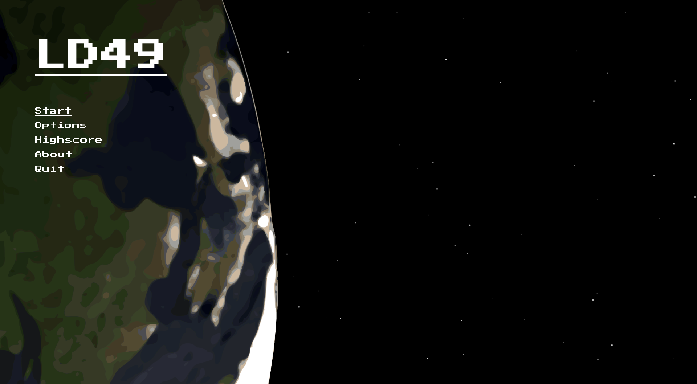

# LD49
This is my entry for Ludum Dare 49 :)
Fly a plane that continually looses its stability and collect fuel.

## Screenshots



## Building
Clone this repository (including rapidjson):
```bash
git clone https://github.com/Jeinzi/ld49.git --recurse-submodules
```

### Linux
Install [SFML](https://www.sfml-dev.org/), a C++ compiler and cmake. Then execute the commands in `make.sh`.

### Windows
- You need a working C++ compiler, for example, install the "Build Tools for Visual Studio" [here](https://visualstudio.microsoft.com/downloads).
- Install cmake for Windows. This may come with the Build Tools for Visual Studio.
- Go to SFML's download page; for example, you can find version 2.5.1 [here](https://www.sfml-dev.org/download/sfml/2.5.1/). Download the appropriate ZIP file for your machine and extract it. Inside, you'll find a directory containing the subdirectories bin/, include/, lib/ etc. Create new a directory with the name "SFML" in the root directory of the repository and copy the aforementioned subdirectories into it.
- Now, execute the commands in `make.bat`.
